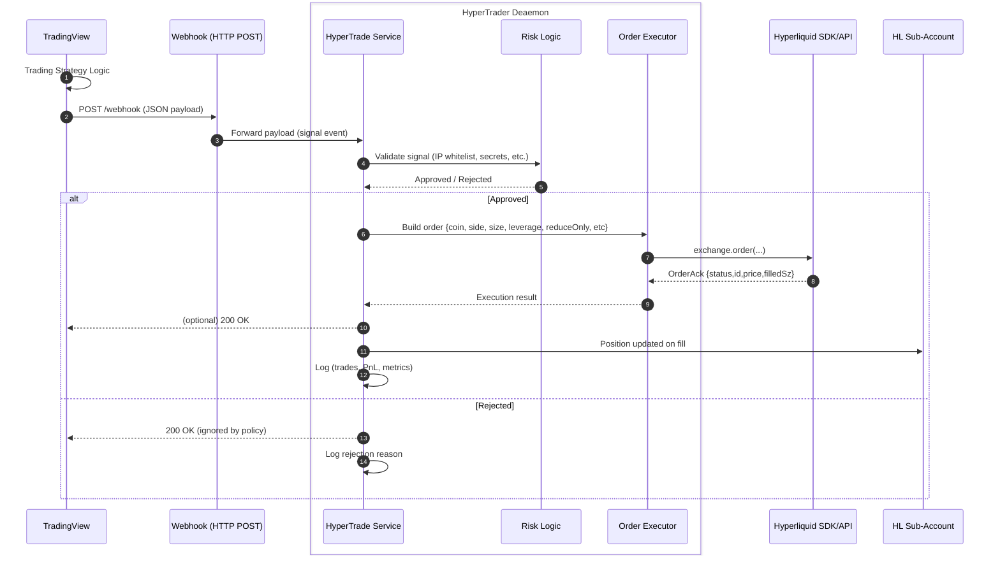

# HyperTrade

HyperTrade is a lightweight server that processes TradingView alerts to execute orders on Hyperliquid.

It validates webhook payloads, enforces secret auth and IP whitelisting, and emits audit logs. 
Use it as a reliable layer between TradingView strategies and your Hyperliquid sub-accounts.

## Features
- TradingView‑compatible payloads with validation.
- IP whitelisting.
- Payload secret.
- Environment secrets.
- Specify a different leverage per asset.
- Health check at `GET /health`.
- Simple config via env vars or `.env` (no external dotenv dependency).

## Rules for Sleeping at Night:

1. One asset per sub-account.
Each Hyperliquid sub-account must be dedicated to a single asset. This ensures isolated margin management and prevents cross-liquidation risks.

2. Leverage Policy.
ALWAYS trade with a maximum leverage of 3x–5x in cross-margin mode to improve risk control. NEVER gamble with 10x–20x leverage.

3. Defensive Capital
Keep a portion of idle funds as defensive capital. This reserve extends the liquidation range and protects the position during periods of volatility.

4. Stop Loss
Never be greedy. Always include a stop loss in your strategy, no matter what. 

## Requirements

- Python 3.10+
- Pip or your preferred package manager

## Install

Using pip:

```bash
python -m venv .venv && source .venv/bin/activate
pip install --upgrade pip
pip install fastapi uvicorn[standard] pydantic pydantic-settings python-dotenv
```

Or add the dependencies from `pyproject.toml` to your environment manager of choice.

## Run

Option 1: via Uvicorn

```bash
uvicorn hypertrade.daemon:app --reload --port 8000
```

Option 2: module entrypoint

```bash
python -m hypertrade
```

Open docs at `http://localhost:8000/docs` (Swagger UI) or `http://localhost:8000/redoc`.

## Environment Variables (required)

The app will not start unless these are set (e.g., in `.env`):

- `HYPERTRADE_MASTER_ADDR`
- `HYPERTRADE_API_WALLET_PRIV`
- `HYPERTRADE_SUBACCOUNT_ADDR`

Copy `.env.example` to `.env` and fill in the values:

```bash
cp .env.example .env
# edit .env and set real values
```

### Set via shell (no .env)

You can also set them directly in your shell and start the server.

Bash/Zsh:

```bash
export HYPERTRADE_MASTER_ADDR=0xYourMasterAddress
export HYPERTRADE_API_WALLET_PRIV='your-private-key'
export HYPERTRADE_SUBACCOUNT_ADDR=0xYourSubaccountAddress
uvicorn hypertrade.daemon:app --reload --port 8000
```

Bash/Zsh one-liner:

```bash
HYPERTRADE_MASTER_ADDR=0x... HYPERTRADE_API_WALLET_PRIV='...' HYPERTRADE_SUBACCOUNT_ADDR=0x... \
  uvicorn hypertrade.daemon:app --reload --port 8000
```

### Troubleshooting

- Verify envs are present in the current shell before starting:

  ```bash
  env | grep ^HYPERTRADE_
  # Expect to see the three variables listed
  ```

- If you use `--reload`, the reloader inherits the current env. Make sure you export in the same shell you use to start Uvicorn.
- If you prefer a file, use `.env` at the project root (already supported by the app), or pass an env one-liner:

  ```bash
  HYPERTRADE_MASTER_ADDR=0x... HYPERTRADE_API_WALLET_PRIV='...' HYPERTRADE_SUBACCOUNT_ADDR=0x... \
    uvicorn app.main:app --reload --port 8000
  ```

## Endpoints

- `GET /health` – health check
- `POST /webhook` – TradingView webhook (supports IP whitelist)

## Configuration

Environment variables are read via `hypertrade.config.Settings` and `.env` (optional). See `.env.example`.

### IP Whitelisting (optional)

Enable IP whitelisting for the TradingView webhook endpoint and set allowed IPs:

```bash
export HYPERTRADE_IP_WHITELIST_ENABLED=true
# Either JSON list:
export 'HYPERTRADE_TV_WEBHOOK_IPS=["52.89.214.238","34.212.75.30","54.218.53.128","52.32.178.7"]'
# Or comma-separated:
export HYPERTRADE_TV_WEBHOOK_IPS=52.89.214.238,34.212.75.30,54.218.53.128,52.32.178.7

# If behind a proxy, keep this true so X-Forwarded-For is honored
export HYPERTRADE_TRUST_FORWARDED_FOR=true
```

You can apply the whitelist dependency to other routes using `require_ip_whitelisted()` from `hypertrade/security.py`.

### Webhook Secret (optional)

For an extra authentication layer, set a shared secret and include it in the payload under `general.secret`.

Env:

```bash
export HYPERTRADE_WEBHOOK_SECRET='your-shared-secret'
```

Payload snippet:

```json
{
  "general": {
    "ticker": "...",
    "exchange": "...",
    "interval": "...",
    "time": "...",
    "timenow": "...",
    "secret": "your-shared-secret"
  }
  // ... rest of payload ...
}
```

Behavior:
- If `HYPERTRADE_WEBHOOK_SECRET` is set, incoming requests must include `general.secret` matching it, or the request is rejected with 401.
- If not set, the secret check is skipped.

### Logging

- Control log level via env var:

  ```bash
  export HYPERTRADE_LOG_LEVEL=INFO   # or DEBUG, WARNING, ERROR
  ```

- Requests are logged with method, route, status, duration, client IP, and request ID.
- Response headers include `X-Request-ID` and `X-Process-Time` for tracing.

### Hardening & Limits

- `HYPERTRADE_MAX_PAYLOAD_BYTES` (default `65536`): reject requests larger than this size with 413.
- `HYPERTRADE_ENABLE_TRUSTED_HOSTS` (default `false`): enable Trusted Host middleware.
- `HYPERTRADE_TRUSTED_HOSTS` (default `*`): comma-separated list of allowed hosts when Trusted Host is enabled.
- Webhook requires `Content-Type: application/json` and returns 415 otherwise.

### TradingView Webhook Payload

Payload (TradingView template) with all the placeholders:

```json
{
  "general": {
    "ticker": "{{ticker}}",
    "exchange": "{{exchange}}",
    "interval": "{{interval}}",
    "time": "{{time}}",
    "timenow": "{{timenow}}"
  },
  "symbol_data": {
    "open": "{{open}}",
    "close": "{{close}}",
    "high": "{{high}}",
    "low": "{{low}}",
    "volume": "{{volume}}",
    "secret": "your-payload-secret"
  },
  "currency": {
    "quote": "{{syminfo.currency}}",
    "base": "{{syminfo.basecurrency}}"
  },
  "position": { "position_size": "{{strategy.position_size}}" },
  "order": {
    "action": "{{strategy.order.action}}",
    "contracts": "{{strategy.order.contracts}}",
    "price": "{{strategy.order.price}}",
    "id": "{{strategy.order.id}}",
    "comment": "{{strategy.order.comment}}",
    "alert_message": "{{strategy.order.alert_message}}"
  },
  "market": {
    "position": "{{strategy.market_position}}",
    "position_size": "{{strategy.market_position_size}}",
    "previous_position": "{{strategy.prev_market_position}}",
    "previous_position_size": "{{strategy.prev_market_position_size}}"
  }
}
```

Notes:
- Numeric fields are accepted as strings and parsed precisely as Decimals.
- Timestamps (`time`, `timenow`) are parsed as ISO-8601 datetimes.

Validation:
- Incoming JSON is validated against a JSON Schema and then parsed into a Pydantic model.
- Schema enforces required sections and basic constraints (action enum, date-time fields, numeric fields).

