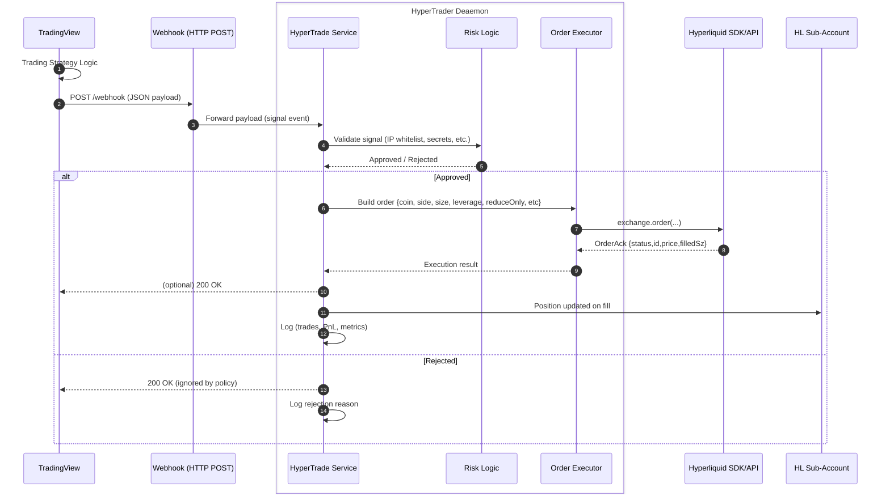

---

[](https://www.python.org/downloads/)
[](https://fastapi.tiangolo.com/)
[](https://docs.pydantic.dev/latest/)
[](https://www.uvicorn.org/)
[](https://docs.astral.sh/ruff/)
[](https://docs.pytest.org/)
[](https://github.com/davassi/hypertrade/stargazers)
[](https://github.com/davassi/hypertrade/issues)
[](https://github.com/davassi/hypertrade/commits/main)

**HyperTrade** is a lightweight server that processes **TradingView** long/short alerts to execute orders on **Hyperliquid**, for automated algorithmic trading.

It validates webhook payloads, enforces secret auth and IP whitelisting, and emits audit logs. Use it as a reliable layer between **TradingView strategies** and your **Hyperliquid sub-accounts**.

[](https://t.me/+VvE0QlK83l00Njc0)

## Features
- TradingView‑compatible payloads with validation.
- IP whitelisting.
- Payload secret.
- Environment secrets.
- Specify a different leverage per asset.
- Health check at `GET /health`.
- Simple config via env vars or `.env` (no external dotenv dependency).


## Before using HyperTrade, 4 Rules for Sleeping at Night:

1. **One asset per sub-account.**
Each Hyperliquid sub-account must be dedicated to a single asset. This ensures isolated margin management and prevents cross-liquidation risks.

2. **Define a Leverage Policy.**  
ALWAYS trade with a maximum leverage of 3x–5x in cross-margin mode to improve risk control. NEVER gamble with a 10x–20x leverage.

3. **Deep Defensive Capital.**  
Keep a portion of idle funds as defensive capital. This reserve extends the liquidation range and protects the position during periods of volatility.

4. **Never forget a Stop Loss.**  
Never be greedy. Always include a stop loss in your strategy, no matter what. 

## Requirements

- Python 3.10+
- Pip or your preferred package manager
- A TradingView subscription.
- A Hyperliquid sub-account.

## Install

Using pip:

```bash
python -m venv .venv && source .venv/bin/activate
pip install --upgrade pip
pip install fastapi uvicorn[standard] pydantic pydantic-settings python-dotenv jsonschema pyTelegramBotAPI
```

## Run

Run via Uvicorn or module entrypoint

```bash
uvicorn hypertrade.daemon:app --host 0.0.0.0 --port 6487
```

```bash
python -m hypertrade
```

## Environment Variables (required)

Hypertrade won't start unless these variables are set:

- `HYPERTRADE_MASTER_ADDR`
- `HYPERTRADE_API_WALLET_PRIV`
- `HYPERTRADE_SUBACCOUNT_ADDR`

```bash
export HYPERTRADE_MASTER_ADDR=0xYourMasterAddress
export HYPERTRADE_API_WALLET_PRIV='your-private-key'
export HYPERTRADE_SUBACCOUNT_ADDR=0xYourSubaccountAddress
uvicorn hypertrade.daemon:app --host 0.0.0.0 --port 6487
```

Personally I prefer storing secrets with Password Store (pass) instead of a `.env` file:

- Project: https://www.passwordstore.org/
- Example exports pulling from pass:

```bash
export HYPERTRADE_MASTER_ADDR="$(pass show hypertrade/master_addr)"
export HYPERTRADE_API_WALLET_PRIV="$(pass show hypertrade/api_wallet_priv)"
export HYPERTRADE_SUBACCOUNT_ADDR="$(pass show hypertrade/subaccount_addr)"
```

## Endpoints

- `GET /health` – health check
- `POST /webhook` – TradingView webhook (supports IP whitelist)

### IP Whitelisting (optional but strongly suggested)

Enable IP whitelisting for the TradingView webhook endpoint and set allowed IPs:

```bash
export HYPERTRADE_IP_WHITELIST_ENABLED=true
export 'HYPERTRADE_TV_WEBHOOK_IPS=["52.89.214.238","34.212.75.30","54.218.53.128","52.32.178.7"]'

# If behind a proxy, keep this true so X-Forwarded-For is honored
export HYPERTRADE_TRUST_FORWARDED_FOR=true
```

You can apply the whitelist dependency to other routes using `require_ip_whitelisted()` from `hypertrade/security.py`.

Note:
- For pydantic-settings v2, complex types like lists must be provided as JSON strings in env vars. Use a JSON list for `HYPERTRADE_TV_WEBHOOK_IPS` (as shown above). Comma-separated values are not supported by the loader.

### Webhook Secret (optional but strongly suggested, part 2)

For an extra authentication layer, set a shared secret and include it in the payload under `general.secret`.

Env:

```bash
export HYPERTRADE_WEBHOOK_SECRET='your-shared-secret'
```

### TradingView Webhook Payload

Payload (TradingView template) with all the placeholders, including secret and leverage. Copy and paste it on as TradingView Alert.

Don't forget to set up first the strategy name, the **"secret": "your-shared-secret"** and the preferred leverage.

```json
{
  "general": {
    "strategy" : "your-strategy-name",
    "ticker": "{{ticker}}",
    "exchange": "{{exchange}}",
    "interval": "{{interval}}",
    "time": "{{time}}",
    "timenow": "{{timenow}}",
    "secret": "your-shared-secret",
    "leverage": "3X"
  },
  "symbol_data": {
    "open": "{{open}}",
    "close": "{{close}}",
    "high": "{{high}}",
    "low": "{{low}}",
    "volume": "{{volume}}"
  },
  "currency": {
    "quote": "{{syminfo.currency}}",
    "base": "{{syminfo.basecurrency}}"
  },
  "position": { "position_size": "{{strategy.position_size}}" },
  "order": {
    "action": "{{strategy.order.action}}",
    "contracts": "{{strategy.order.contracts}}",
    "price": "{{strategy.order.price}}",
    "id": "{{strategy.order.id}}",
    "comment": "{{strategy.order.comment}}",
    "alert_message": "{{strategy.order.alert_message}}"
  },
  "market": {
    "position": "{{strategy.market_position}}",
    "position_size": "{{strategy.market_position_size}}",
    "previous_position": "{{strategy.prev_market_position}}",
    "previous_position_size": "{{strategy.prev_market_position_size}}"
  }
}
```

Notes:
- Numeric fields are accepted as strings and parsed precisely as Decimals.
- Timestamps (`time`, `timenow`) are parsed as ISO-8601 datetimes.

Validation:
- Incoming JSON is validated against a JSON Schema and then parsed into a Pydantic model.
- Schema enforces required sections and basic constraints (action enum, date-time fields, numeric fields).

Behavior:
- If `HYPERTRADE_WEBHOOK_SECRET` is set, incoming requests must include `general.secret` matching it, or the request is rejected with 401.
- If not set, the secret check is skipped.

### Additional Security & Limits

- `HYPERTRADE_MAX_PAYLOAD_BYTES` (default `65536`): reject requests larger than this size with 413.
- `HYPERTRADE_ENABLE_TRUSTED_HOSTS` (default `false`): enable Trusted Host middleware.
- `HYPERTRADE_TRUSTED_HOSTS` (default `*`): comma-separated list of allowed hosts when Trusted Host is enabled.
- Webhook requires `Content-Type: application/json` and returns 415 otherwise.

### Telegram Notifications (optional)

Enable Telegram alerts for processed webhooks. Set the following env vars:

```bash
# Enable/disable without removing other variables (default: true)
export HYPERTRADE_TELEGRAM_ENABLED=true

# Telegram bot token and chat id
export HYPERTRADE_TELEGRAM_BOT_TOKEN=123456:ABCDEF-your-bot-token
export HYPERTRADE_TELEGRAM_CHAT_ID=987654321
```

When enabled, each accepted webhook enqueues a background task that sends a message with the parsed signal, ticker, action, contracts and price. 
If either token or chat id is missing or `HYPERTRADE_TELEGRAM_ENABLED=false`, no message is sent.

## Sequence diagram


